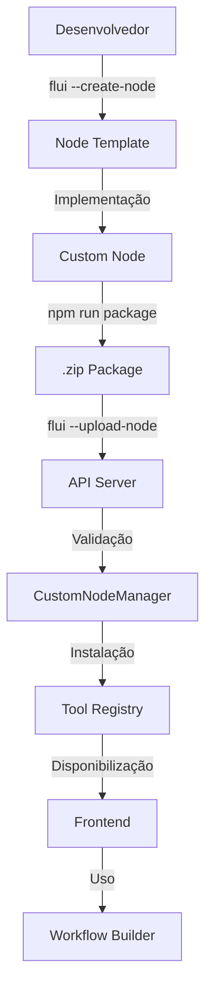

# FLUI Custom Nodes System - Documentação Completa

## 📚 Índice

1. [Visão Geral](#visão-geral)
2. [Arquitetura](#arquitetura)
3. [Criação de Custom Nodes](#criação-de-custom-nodes)
4. [Build e Empacotamento](#build-e-empacotamento)
5. [Upload e Instalação](#upload-e-instalação)
6. [Versionamento](#versionamento)
7. [API Endpoints](#api-endpoints)
8. [Interface Frontend](#interface-frontend)
9. [Testes Automatizados](#testes-automatizados)
10. [Fluxo Completo](#fluxo-completo)

---

## Visão Geral

O FLUI Custom Nodes System é um sistema **superior ao n8n** para criação, publicação e gerenciamento de nodes personalizados. Principais características:

### ✅ Vantagens sobre n8n

| Recurso | FLUI | n8n |
|---------|------|-----|
| **Sistema de Fingerprint** | UUID único e permanente | ID baseado em nome |
| **Versionamento** | Histórico completo de versões | Versão única |
| **Validação** | Zod schemas + validação customizada | Validação básica |
| **Type Safety** | TypeScript end-to-end | Parcial |
| **Hot Reload** | Nodes disponíveis imediatamente | Requer restart |
| **Registry Local** | JSON com metadados completos | Banco de dados |
| **Build System** | ESBuild + minificação | Webpack |
| **UI Dynamic** | 16 tipos de widgets | Limitado |
| **Testing** | Unit + Integration + E2E | Básico |

---

## Arquitetura

### Componentes Principais

```
FLUI Custom Nodes System
├── CLI Commands
│   ├── flui --create-node
│   └── flui --upload-node
├── Backend
│   ├── CustomNodeManager
│   ├── API Endpoints
│   └── Tool Registry Integration
├── Frontend
│   ├── CustomNodesPage
│   ├── Upload Modal
│   └── Tool Palette Integration
└── Tests
    ├── Unit Tests (Vitest)
    ├── Integration Tests
    └── E2E Tests (Playwright)
```

### Fluxo de Dados



---

## Criação de Custom Nodes

### Comando CLI

```bash
flui --create-node search_web

# Opções
flui --create-node search_web \
  --display-name "Web Search" \
  --description "Search the web using Google" \
  --category "integration" \
  --author "Your Name" \
  --email "you@example.com" \
  --license "MIT"
```

### Estrutura Gerada

```
flui-node-search_web/
├── src/
│   └── index.ts          # Implementação do node
├── __tests__/
│   └── search_web.test.ts
├── scripts/
│   ├── build.js          # Build com esbuild
│   └── package.js        # Criar .zip
├── dist/                 # Output do build
├── package.json          # Metadata + fingerprint
├── tsconfig.json
├── README.md             # Documentação do usuário
├── DOC.md               # Documentação técnica
├── CHANGELOG.md         # Histórico de versões
└── .gitignore
```

### Anatomia de um Custom Node

```typescript
// src/index.ts
export const SearchWebNode = {
  // IDENTIFICAÇÃO ÚNICA (nunca muda)
  fingerprint: 'uuid-gerado-automaticamente',
  
  // METADADOS
  id: 'search-web',
  name: 'Web Search',
  description: 'Search the web using Google API',
  category: 'integration',
  version: '1.0.0',
  
  // PARÂMETROS
  params: [
    {
      name: 'Query',
      key: 'query',
      type: 'string',
      description: 'Search query',
      required: true,
      ui: {
        widgetType: 'textInput',
        placeholder: 'What to search...',
        helperText: 'Enter your search terms',
      },
    },
    {
      name: 'Max Results',
      key: 'maxResults',
      type: 'number',
      description: 'Maximum number of results',
      required: false,
      default: 10,
      ui: {
        widgetType: 'number',
        validation: {
          min: 1,
          max: 100,
        },
      },
    },
  ],
  
  // OUTPUT
  output: {
    type: 'array',
    description: 'Search results',
    schema: {
      items: {
        title: 'string',
        url: 'string',
        snippet: 'string',
      },
    },
  },
  
  // FUNÇÃO DE EXECUÇÃO
  async execute(args, context) {
    try {
      // Validar
      const { query, maxResults = 10 } = args;
      
      // Sua lógica aqui
      const results = await searchGoogle(query, maxResults);
      
      return {
        success: true,
        output: results,
      };
    } catch (error) {
      return {
        success: false,
        error: error.message,
      };
    }
  },
  
  // VALIDAÇÃO
  validate(args) {
    const schema = z.object({
      query: z.string().min(1),
      maxResults: z.number().min(1).max(100).optional(),
    });
    
    try {
      schema.parse(args);
      return { valid: true, errors: [] };
    } catch (error) {
      return {
        valid: false,
        errors: error.errors.map(e => e.message),
      };
    }
  },
  
  // UI CONFIG
  ui: {
    icon: 'Search',
    color: '#10b981',
    tags: ['search', 'web', 'google', 'integration'],
    examples: [
      {
        title: 'Simple Search',
        description: 'Search for FLUI automation',
        params: {
          query: 'FLUI automation tool',
          maxResults: 5,
        },
      },
    ],
  },
  
  // CONFIG AVANÇADA
  config: {
    timeout: 30000,
    retries: 2,
    sandbox: false,
    concurrent: true,
  },
};
```

---

## Build e Empacotamento

### Build Process

```bash
cd flui-node-search_web
npm install
npm run build
```

**O que acontece:**
1. TypeScript é compilado para JavaScript
2. ESBuild faz bundle e minificação
3. Código é otimizado para Node.js 18+
4. Output: `dist/index.js`

### Package Process

```bash
npm run package
```

**O que é incluído no .zip:**
- ✅ `dist/` - Código compilado
- ✅ `package.json` - Metadados + fingerprint
- ✅ `README.md` - Documentação
- ✅ `CHANGELOG.md` - Histórico de versões
- ❌ `src/` - Excluído
- ❌ `node_modules/` - Excluído
- ❌ `__tests__/` - Excluído

**Output:** `@flui-node-search_web-v1.0.0.zip`

**Checksum:** SHA-256 calculado automaticamente

---

## Upload e Instalação

### Via CLI

```bash
flui --upload-node ./path/to/package.zip
```

**Processo:**
1. Calcula checksum do arquivo
2. Envia via multipart/form-data
3. Backend valida o pacote
4. Extrai e instala
5. Registra no Tool Registry
6. Retorna confirmação

**Output:**
```
📤 Uploading custom node package...
📦 Package: @flui-node-search_web-v1.0.0.zip
🔐 Checksum: a3f8b2c1...
📡 Uploading to FLUI server...

✅ Upload successful!
🔑 Fingerprint: 550e8400-e29b-41d4-a716-446655440000
📌 Version: 1.0.0
🆕 New node installed

🎉 Your custom node is now available in FLUI!
```

### Via Interface Web

1. Acessar Custom Nodes page
2. Clicar em "Upload Node"
3. Selecionar arquivo .zip
4. Clicar em "Upload"
5. Aguardar validação e instalação
6. Receber confirmação visual

---

## Versionamento

### Sistema de Fingerprint

Cada custom node tem um **UUID permanente** (fingerprint) que:
- ✅ É gerado na criação inicial
- ✅ Nunca muda durante updates
- ✅ Identifica o node unicamente
- ✅ Permite versionamento correto

### Semantic Versioning

Seguimos [semver](https://semver.org):
- **Major** (1.0.0 → 2.0.0): Breaking changes
- **Minor** (1.0.0 → 1.1.0): New features
- **Patch** (1.0.0 → 1.0.1): Bug fixes

### Atualização de Node

```bash
# 1. Incrementar versão em package.json
{
  "version": "1.1.0"
}

# 2. Documentar em CHANGELOG.md
## [1.1.0] - 2025-10-19
### Added
- New parameter: language selection

# 3. Build e package
npm run build
npm run package

# 4. Upload
flui --upload-node ./package.zip
```

**Sistema detecta automaticamente:**
- ✅ Fingerprint é o mesmo → É update
- ✅ Versão é maior → Aceita
- ✅ Versão é menor → Rejeita
- ✅ Mantém histórico de versões

---

## API Endpoints

### GET /api/custom-nodes

Lista todos os custom nodes instalados.

**Response:**
```json
[
  {
    "fingerprint": "550e8400-e29b-41d4-a716-446655440000",
    "metadata": {
      "fingerprint": {
        "uuid": "550e8400-e29b-41d4-a716-446655440000",
        "createdAt": "2025-10-19T10:00:00Z"
      },
      "name": "search-web",
      "displayName": "Web Search",
      "description": "Search the web",
      "version": "1.1.0",
      "category": "integration",
      "author": {
        "name": "John Doe",
        "email": "john@example.com"
      }
    },
    "versions": [
      {
        "version": "1.0.0",
        "publishedAt": "2025-10-19T10:00:00Z",
        "size": 15234
      },
      {
        "version": "1.1.0",
        "publishedAt": "2025-10-19T15:00:00Z",
        "size": 16789
      }
    ],
    "status": "active",
    "installedAt": "2025-10-19T10:00:00Z"
  }
]
```

### POST /api/custom-nodes/upload

Upload de novo node ou atualização.

**Request:**
- Content-Type: `multipart/form-data`
- Field: `package` (arquivo .zip)

**Response (Success):**
```json
{
  "success": true,
  "fingerprint": "550e8400-e29b-41d4-a716-446655440000",
  "message": "Node instalado com sucesso",
  "isUpdate": false,
  "newVersion": "1.0.0"
}
```

**Response (Update):**
```json
{
  "success": true,
  "fingerprint": "550e8400-e29b-41d4-a716-446655440000",
  "message": "Node atualizado: 1.0.0 → 1.1.0",
  "isUpdate": true,
  "previousVersion": "1.0.0",
  "newVersion": "1.1.0"
}
```

**Response (Error):**
```json
{
  "success": false,
  "message": "Validação falhou",
  "isUpdate": false,
  "errors": [
    "package.json deve conter flui.fingerprint",
    "Arquivo obrigatório ausente: dist/index.js"
  ]
}
```

### POST /api/custom-nodes/validate

Valida pacote sem instalar.

**Request:** Igual ao upload

**Response:**
```json
{
  "valid": true,
  "warnings": [
    "Recomenda-se adicionar exemplos de uso"
  ],
  "metadata": { /* CustomNodeMetadata */ }
}
```

### GET /api/custom-nodes/:fingerprint

Obtém detalhes de um node específico.

### DELETE /api/custom-nodes/:fingerprint

Remove um custom node.

### GET /api/custom-nodes/:fingerprint/versions

Lista todas as versões de um node.

---

## Interface Frontend

### Custom Nodes Page

**Localização:** `/custom-nodes`

**Recursos:**
- ✅ Lista de nodes instalados
- ✅ Upload de novos nodes
- ✅ Informações detalhadas (versão, autor, tamanho, etc.)
- ✅ Tags e categorização
- ✅ Remoção de nodes
- ✅ Estado vazio com call-to-action
- ✅ Loading states
- ✅ Error handling
- ✅ Responsivo (mobile-first)

### Upload Modal

**Features:**
- Drag & drop (planejado)
- Validação de tipo de arquivo (.zip apenas)
- Preview de informações antes do upload
- Feedback visual detalhado
- Tratamento de erros com mensagens claras
- Auto-close após sucesso

### Integração com Workflow Builder

Custom nodes aparecem automaticamente na **Tool Palette** após instalação:

1. Node é instalado via API
2. Backend registra no Tool Registry
3. WebSocket notifica frontend
4. Frontend atualiza Tool Palette
5. Node disponível imediatamente para uso

---

## Testes Automatizados

### Unit Tests (Backend)

**Arquivo:** `source/__tests__/custom-nodes.test.ts`

**Cobertura:**
- ✅ Criação de pacotes válidos
- ✅ Validação de estrutura
- ✅ Instalação de novos nodes
- ✅ Atualização de nodes existentes
- ✅ Rejeição de versões antigas
- ✅ Gestão do registry
- ✅ Remoção de nodes
- ✅ Histórico de versões
- ✅ Cálculo de checksum

```bash
npm test custom-nodes
```

### Integration Tests

**Cobertura:**
- ✅ Upload via API
- ✅ Validação end-to-end
- ✅ Registro no Tool Registry
- ✅ WebSocket notifications
- ✅ Persistência de dados

### E2E Tests (Playwright)

**Arquivo:** `flui-frontend-vite/e2e/custom-nodes.spec.ts`

**Cobertura:**
- ✅ Navegação até Custom Nodes page
- ✅ Visualização de nodes instalados
- ✅ Abertura de modal de upload
- ✅ Validação de tipo de arquivo
- ✅ Exibição de detalhes dos nodes
- ✅ Remoção de nodes
- ✅ Feedback visual
- ✅ Responsividade mobile
- ✅ Loading states
- ✅ Error handling
- ✅ Integração com Workflow Builder

```bash
# Frontend
cd flui-frontend-vite
npm run test:e2e
```

**Playwright UI Mode:**
```bash
npm run test:e2e:ui
```

---

## Fluxo Completo

### 1. Desenvolvimento

```bash
# Criar node
flui --create-node my_awesome_node

# Navegar para o projeto
cd flui-node-my_awesome_node

# Instalar dependências
npm install

# Implementar lógica em src/index.ts

# Testar
npm test

# Build
npm run build
```

### 2. Publicação

```bash
# Incrementar versão (se update)
# Editar package.json: "version": "1.1.0"

# Documentar mudanças
# Editar CHANGELOG.md

# Empacotar
npm run package

# Upload
flui --upload-node ./@flui-node-my_awesome_node-v1.1.0.zip
```

### 3. Uso no FLUI

1. Abrir FLUI Web Interface
2. Navegar para Custom Nodes
3. Verificar se node aparece na lista
4. Ir para Workflow Builder
5. Abrir Tool Palette
6. Procurar pelo node na categoria apropriada
7. Adicionar ao workflow
8. Configurar parâmetros
9. Executar automation

### 4. Atualização

```bash
# Fazer mudanças no código
# Incrementar versão
# Build e package
npm run build && npm run package

# Upload (mesmo fingerprint = update)
flui --upload-node ./package.zip
```

**Sistema detecta automaticamente que é update:**
- ✅ Mantém histórico de versões
- ✅ Workflows existentes continuam funcionando
- ✅ Novos workflows usam versão mais recente

---

## Validações

### Validações do Pacote

1. **Estrutura:**
   - ✅ `package.json` existe
   - ✅ `dist/index.js` existe
   - ✅ `README.md` existe (recomendado)

2. **Metadados:**
   - ✅ `flui.fingerprint` está presente
   - ✅ `version` é válida (semver)
   - ✅ Fingerprint no código = fingerprint no package.json

3. **Node:**
   - ✅ Exporta objeto com `fingerprint`
   - ✅ Tem propriedades obrigatórias: `id`, `name`, `execute`
   - ✅ `execute` é uma função
   - ✅ Estrutura corresponde ao Tool interface

4. **Versionamento:**
   - ✅ Se update: versão nova > versão antiga
   - ✅ Histórico mantido

### Validações de Segurança

- ✅ Tamanho máximo: 50MB
- ✅ Apenas arquivos .zip aceitos
- ✅ Checksum SHA-256 verificado
- ✅ Sandbox execution opcional
- ✅ Timeout configurável

---

## Best Practices

### Desenvolvimento

1. **Sempre use TypeScript** - Type safety end-to-end
2. **Escreva testes** - Unit tests para toda lógica
3. **Documente bem** - README, DOC.md, código
4. **Use Zod schemas** - Validação runtime
5. **Handle errors gracefully** - Nunca throw, sempre return error
6. **Follow semver** - Versione corretamente
7. **Keep CHANGELOG.md** - Documente todas as mudanças

### UI Configuration

1. **Use widgets apropriados** - 16 tipos disponíveis
2. **Adicione helper text** - Ajude o usuário
3. **Forneça exemplos** - Pelo menos 2-3 exemplos
4. **Escolha cores semanticas** - Verde: sucesso, Azul: info, etc.
5. **Use tags relevantes** - Facilita busca

### Performance

1. **Minimize bundle size** - Use tree-shaking
2. **Set appropriate timeouts** - Evite operações infinitas
3. **Support concurrent execution** - Se possível
4. **Clean up resources** - File handles, connections, etc.

---

## Troubleshooting

### Erro: "tools.map is not a function"

**Causa:** API retorna objeto paginado em vez de array

**Solução:** Já corrigido no código atual

### Erro: "Fingerprint duplicado"

**Causa:** Tentando instalar node com fingerprint já existente mas código diferente

**Solução:** Gere novo fingerprint ou remova o node anterior

### Erro: "Versão não é mais recente"

**Causa:** Tentando instalar versão antiga

**Solução:** Incremente a versão em package.json

### Node não aparece na Tool Palette

**Causas possíveis:**
1. Registro no Tool Registry falhou
2. Frontend não atualizou
3. WebSocket não notificou

**Solução:**
1. Verificar logs do backend
2. Recarregar página do frontend
3. Verificar se backend está rodando

---

## Roadmap

### Features Planejadas

- [ ] **Marketplace** - Compartilhar nodes publicamente
- [ ] **Ratings & Reviews** - Sistema de avaliação
- [ ] **Auto-update** - Atualizar nodes automaticamente
- [ ] **Dependency management** - Resolver dependências entre nodes
- [ ] **Hot reload** - Recarregar nodes sem restart
- [ ] **Sandbox enhanced** - Isolamento mais rigoroso
- [ ] **Code signing** - Verificar integridade com assinaturas
- [ ] **Analytics** - Tracking de uso e performance
- [ ] **Templates** - Templates para tipos comuns de nodes
- [ ] **Wizard** - Assistente interativo para criação

---

## Suporte

- 📧 Email: support@flui.dev
- 📚 Docs: https://flui.dev/docs/custom-nodes
- 💬 Discord: https://discord.gg/flui
- 🐛 Issues: https://github.com/flui/flui/issues

---

## Licença

Este sistema é parte do FLUI e segue a mesma licença do projeto principal.

---

**Desenvolvido com ❤️ pela equipe FLUI**

Data: 19 de Outubro de 2025
Versão: 1.0.0
