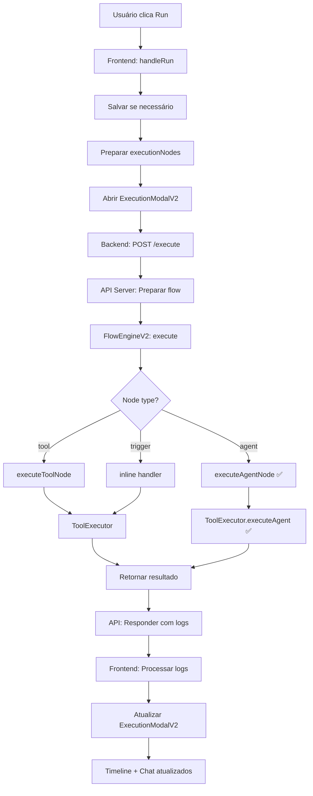

# Resumo Final: Sistema de Execução de Automações

## ✅ Problemas Resolvidos

### 1. Backend Falhando com Agentes
- ❌ **Antes**: FlowEngineV2 não suportava tipo 'agent'
- ✅ **Depois**: Implementado `executeAgentNode()`

### 2. IDs Não Chegavam ao Engine
- ❌ **Antes**: `node.config.toolId` (errado)
- ✅ **Depois**: `node.toolId` + `node.agentId` passados corretamente

### 3. Frontend Só Simulava
- ❌ **Antes**: setTimeout simulando execução
- ✅ **Depois**: Processa resultado real do backend

### 4. Erros Não Apareciam
- ❌ **Antes**: Apenas "success data = {}"
- ✅ **Depois**: Erros claros no chat e timeline

## 🎨 Novo ExecutionModalV2

### Layout Responsivo
- ✅ **1 coluna única** (não 2)
- ✅ **Mobile-first** design
- ✅ **Timeline integrada** no chat
- ✅ **Touch-friendly**

### Features Visuais
- ✨ **Timeline vertical** com linha de conexão
- ✨ **Estados animados**: pending → running → success/error
- ✨ **Pulse animation** no node ativo
- ✨ **Gradientes futuristas** nas mensagens
- ✨ **Cards de arquivo** com download
- ✨ **Logs detalhados** com input/output

### Mensagens Automáticas
```
🚀 Iniciando execução...
✅ Manual Trigger executado
✅ My Agent executado
📁 2 arquivo(s) gerado(s)
🎉 Automação concluída! ⏱️ 1.76s
```

### Tratamento de Erros
```
❌ My Agent falhou
   agentId não especificado

💥 Automação falhou
• My Agent: agentId não especificado
🔍 Verifique a aba de Logs
```

## 📊 Fluxo Completo



## 🔧 Correções Técnicas

### FlowEngineV2
```typescript
// ✅ Adicionado
if (node.type === 'agent') {
  output = await this.executeAgentNode(node, inputData);
}

private async executeAgentNode(node, inputData) {
  const agentId = node.agentId;
  const message = resolvedConfig.message || '';
  
  const result = await ToolExecutor.execute(
    `agent-${agentId}`,
    { message, ...resolvedConfig },
    context
  );
  
  return [createNodeDataItem(result.result, ...)];
}
```

### API Server
```typescript
// ✅ Corrigido
nodes: automation.nodes.map(node => ({
  type: node.toolId || node.type,  // ✅ toolId correto
  agentId: node.agentId,           // ✅ Passado
  toolId: node.toolId,             // ✅ Passado
  mcpId: node.mcpId,               // ✅ Passado
  mcpToolId: node.mcpToolId,       // ✅ Passado
}))
```

### WorkflowEditor
```typescript
// ✅ Processar resultado real
const execution = await executeAutomation({ id })
const processedLogs = execution.logs.map(...)
const updatedNodes = executionNodes.map(node => {
  const hasError = nodeLogs.some(log => log.level === 'error')
  return { ...node, status: hasError ? 'error' : 'success', ... }
})

setExecutionContext({
  status: execution.status,
  nodes: updatedNodes,
  logs: processedLogs,
  error: execution.error,
})
```

### ExecutionModalV2
```typescript
// ✅ Mostrar todos os erros
const errorLogs = context.logs.filter(log => log.level === 'error')
const errorMessages = errorLogs.map(log => 
  `• **${log.nodeName}**: ${log.message}`
).join('\n')

// ✅ Erro no card do node
{node.error && (
  <div className="text-red-600 bg-red-500/10">
    💥 {node.error}
  </div>
)}
```

## 📁 Arquivos Criados/Modificados

### Backend
1. `source/core/flowEngineV2.ts` - Suporte a agents
2. `source/services/apiServer.ts` - IDs corretos

### Frontend  
3. `flui-frontend/src/pages/WorkflowEditor.tsx` - Resultado real
4. `flui-frontend/src/components/automations/ExecutionModalV2.tsx` - UI melhorada

### Documentação
5. `EXECUTION_FIX.md` - Análise detalhada
6. `EXECUTION_MODAL_V2_FEATURES.md` - Features do modal
7. `EXECUTION_MODAL_USAGE.md` - Guia de uso
8. `EXECUTION_MODAL_RESPONSIVE.md` - Design responsivo
9. `RESUMO_FINAL_EXECUCAO.md` - Este resumo

## ✨ Testes

### Teste 1: Trigger → Agent
```
● ✓ Manual Trigger (234ms)
● ✓ My Agent (1523ms)
```
✅ **Deve funcionar**

### Teste 2: Trigger → Tool → Agent
```
● ✓ Manual Trigger (234ms)
● ✓ Read File (567ms)
● ✓ Process Agent (2341ms)
```
✅ **Deve funcionar**

### Teste 3: Agent com Erro
```
● ✓ Manual Trigger (234ms)
● ✗ My Agent
  💥 agentId não especificado
```
✅ **Erro aparece claramente**

---

**Status**: ✅ Todos os problemas resolvidos
**Backend**: ✅ Suporte completo a agents
**Frontend**: ✅ Logs reais e erros claros
**UI**: ✅ Responsiva e elegante
