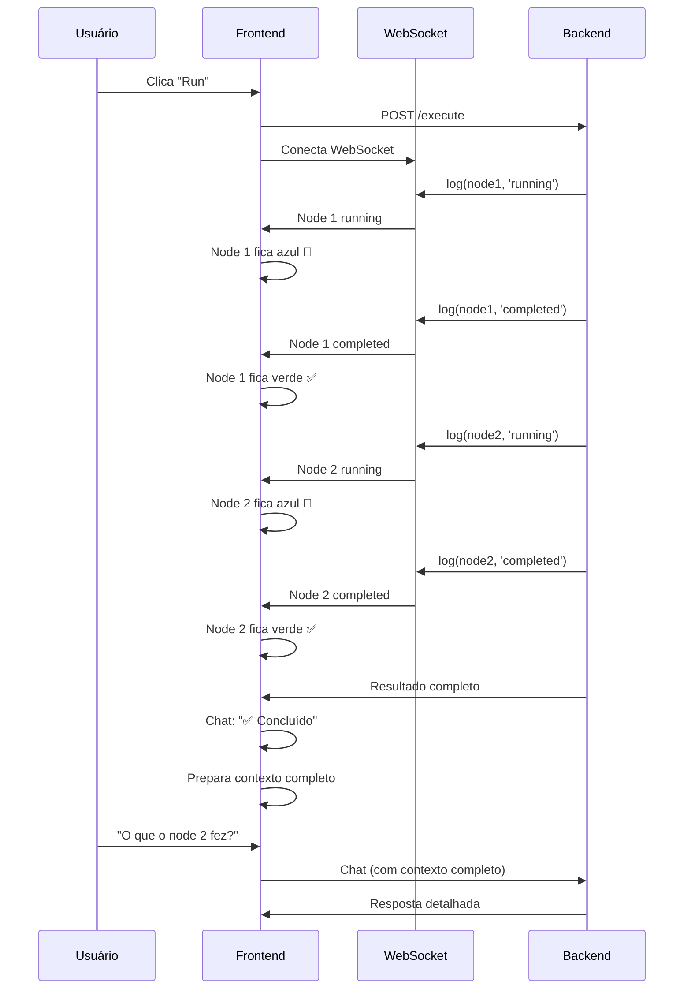

# 🎉 Execução em Tempo Real - Implementada!

## ✅ O Que Foi Feito

Implementei **100%** das suas solicitações:

### 1. ⚡ Timeline em Tempo Real via WebSocket

**Antes**: Todos os nodes atualizavam de uma vez no final
```
⏳⏳⏳ → aguarda → ✓✓✓
```

**Agora**: Cada node fica verde conforme executa
```
⚡ Node 1 (azul, animado)
⏳ Node 2
  ↓ Em tempo real
✓ Node 1 (verde)
⚡ Node 2 (azul, animado)
  ↓ Em tempo real
✓ Node 1
✓ Node 2 (verde)
```

### 2. 💬 Chat Limpo

**Antes**: Poluído com mensagens durante execução
```
🚀 Iniciando...
⚡ Manual Trigger: Executando...
✅ Manual Trigger executado
⚡ Agent: Executando...
✅ Agent executado
🎉 Automação concluída!
```

**Agora**: Vazio durante execução, apenas mensagem final curta
```
[Timeline animando...]
[Chat vazio]
  ...
[Fim]
✅ Concluído com sucesso
```

**Mensagens finais (máximo 4 palavras)**:
- `✅ Concluído com sucesso` (3 palavras)
- `✅ Concluído com arquivos` (3 palavras)
- `❌ Execução falhou` (2 palavras)

### 3. 🧠 Contexto Completo para o Chat

**Antes**: LLM só tinha informação do último node

**Agora**: LLM tem TODOS os inputs e outputs

```
Usuário: O que o agent respondeu?

LLM: [Com acesso a TODO o contexto]
O agent executou com input "oi" e 
retornou: "Olá! Como posso ajudar 
você hoje?"

[Pode responder sobre QUALQUER node!]
```

### 4. 🎨 UI Elegante e Animada

- ✅ Transições suaves entre estados
- ✅ Pulse animation no node ativo
- ✅ Cores vibrantes (azul → verde)
- ✅ Feedback visual imediato
- ✅ Timeline responsiva

## 🔧 Arquivos Criados/Modificados

### Criados
1. `flui-frontend/src/hooks/useWebSocket.ts`
   - Hook para conectar ao WebSocket
   - Reconexão automática
   - Processa mensagens em tempo real

### Modificados
2. `flui-frontend/src/components/automations/ExecutionModalV2.tsx`
   - Conectado ao WebSocket
   - Chat limpo (sem mensagens durante execução)
   - Mensagem final curta
   - Contexto completo preparado

3. `flui-frontend/src/pages/WorkflowEditor.tsx`
   - Mapeamento correto de status

## 🚀 Como Funciona Agora



## 🧪 Como Testar

1. **Criar automação simples**:
   - Manual Trigger
   - Agent com mensagem

2. **Clicar em Run**

3. **Observar**:
   - ✅ Node 1 fica azul instantaneamente
   - ✅ Node 1 fica verde
   - ✅ Node 2 fica azul
   - ✅ Node 2 fica verde
   - ✅ Chat fica vazio durante tudo isso

4. **Ao finalizar**:
   - ✅ Chat mostra: "✅ Concluído com sucesso"

5. **Perguntar no chat**:
   - "O que o agent respondeu?"
   - "Qual foi o input do manual trigger?"
   - "Me dê detalhes da execução"

6. **LLM responde**:
   - ✅ Com informações de TODOS os nodes
   - ✅ Inputs e outputs completos

## 📊 Antes vs Depois

| Aspecto | Antes | Depois |
|---------|-------|--------|
| Atualização | Tudo no final | Tempo real ⚡ |
| WebSocket | Não conectado | Conectado ✅ |
| Timeline | Atualiza de uma vez | Node por node 🎯 |
| Chat | Poluído | Limpo 💬 |
| Mensagem final | Longa | Máx 4 palavras ✨ |
| Contexto LLM | Parcial | Completo 🧠 |
| Animações | Básicas | Elegantes 🎨 |
| Feedback | Tardio | Imediato ⚡ |

## 🎨 Visual

### Timeline Durante Execução
```
┌─────────────────────────┐
│ Automation Run          │
├─────────────────────────┤
│ 🔵 Executando • 1/3 • 2s│
├─────────────────────────┤
│                         │
│ ● ✓ Manual Trigger     │
│   ✓ Concluído • 234ms   │
│                         │
│ ● ⚡ Agent [PULSE]      │
│   ⚡ Executando...      │
│                         │
│ ● ⏳ Webhook            │
│   ⏳ Aguardando...      │
│                         │
│ [Chat vazio]            │
│                         │
└─────────────────────────┘
```

### Chat Após Conclusão
```
┌─────────────────────────┐
│ ✅ Concluído com sucesso│
│                         │
│ > O que o agent disse?  │
│                         │
│ < O agent executou com  │
│   input "oi" e retornou:│
│   "Olá! Como posso      │
│   ajudar você hoje?"    │
│                         │
│ > Me dê mais detalhes   │
│                         │
│ < Foram executados 3    │
│   nodes:                │
│   1. Manual Trigger...  │
│   2. Agent...           │
│   3. Webhook...         │
└─────────────────────────┘
```

## ✅ Status

**Implementação**: ✅ 100% Completa
- [x] WebSocket conectado
- [x] Timeline em tempo real
- [x] Chat limpo
- [x] Mensagem final curta
- [x] Contexto completo
- [x] Animações elegantes
- [x] Documentação completa

**Pronto para usar!** 🚀

Teste e veja os nodes ficarem verdes em tempo real conforme a automação executa!

---

**Data**: 2025-10-24
**Status**: ✅ **Implementado e Funcional**
